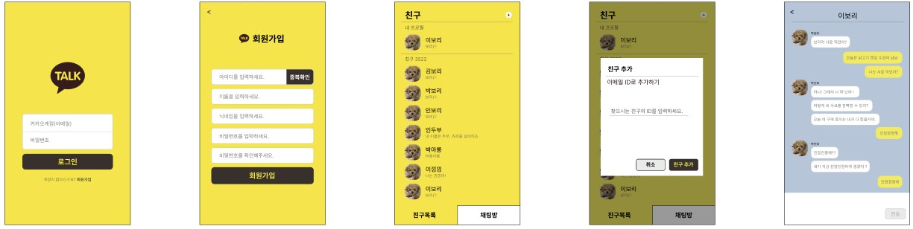

# 카카오톡 클론코딩 - 코코아톡


## <a href="http://cocoatalk.s3-website.ap-northeast-2.amazonaws.com/"> 🎥&nbsp;&nbsp;배포사이트 </a>
## <a href="https://youtu.be/o6ZKtll9-jk/"> 📺&nbsp;&nbsp;유튜브영상 </a>
### 항해99 이노베이션 - Clone Coding Project : cocoatalk [ FE : 인소현, 정종성 ]
<a href="https://github.com/INSOCCI/"> 🎈&nbsp;&nbsp;FE : 인소현 Github 주소 </a>
<a href="https://github.com/JJSEONG/"> 🎈&nbsp;&nbsp;FE : 정종성 Github 주소 </a>

<br />

# - 프로젝트 개요
1. 명칭 : cocoatalk [코코아톡]
2. 개발 인원 : 6명 [ FE : 2명 / BE : 4명 ]
3. 개발 기간 : 2022.07.29 ~ 2022.08.04
4. 주요 기능 : SockJS를 이용한 채팅 구현 / WebSocket 사용
5. 개발 언어 : JavaScript
6. 개발 라이브러리 : React.js
7. 형상 관리 툴 : Git
8. 협업 툴 : Slack, Gather
9. 간단 소개 : React - Spring 간의 웹소켓 기반 채팅 프로젝트

<br />

# - 프로젝트 내용
* 카카오톡의 채팅 서비스를 WebSocket을 이용해 구현해보는 내용
* 프론트엔드와 백엔드를 분리하여 프로젝트 개발
  * 각 파트별로 Repository를 생성 후 작업
  * 프론트: AWS S3
  * 백엔드: AWS EC2
  * 빌드 후, S3와 EC2를 연동
  * API 명세서에 따라 API호출 및 응답 확인
* React, Spring을 기반으로한 채팅 웹 애플리케이션
* 카카오톡 서비스를 따라 구현해 본 채팅 서비스
* JWT Token을 사용한 회원가입 및 로그인 사용
* Session Storage를 사용하여 Token 정보 저장
* 회원정보탭에서 사용자 정보 수정 - [구현못함]
* 닉네임, 프로필 사진 - [구현못함]
* Websocket 기반의 채팅 기능
  * sockjs-client, stompjs
  * 사용자의 메시지와 상대방의 메시지를 구분하는 ui 적용

<br />

# - 주요 사용 기능
1. WebSocket
    * HTTP는 실시간 통신이 불가능
    * WebSocket은 실시간 통신의 문제를 해결
    * 실시간 양방향 통신을 지원
    * 핸드쉐이크(HTTP) -> 양방향 통신
2. Stomp
    * Simple Text Oriented Messaging Protocol
    * 텍스트 기반의 프로토콜
    * `connect`, `subscribe`, `send`, `disconnect`, `usubscribe` 메소드
    * connect -> subscribe 이후 별도의 요청 없이 서버로부터 데이터를 받을 수 있는 상태가 된다.
    * 이 때, send메소드로 데이터를 전송할 수 있다.
    * send로 메시지를 보내면 subscribe상태이므로 자동으로 자신의 메시지도 표시된다.
    * 연결을 해제할 때, disconnect, unsubscribe 를 한다.

<br />

# - 사용 패키지
1. redux / react-redux → 데이터 전역 관리를 위한 라이브러리 [ Redux를 사용하기 위해 사용 ]
2. redux-thunk → Middleware를 사용하여 DB와 Local의 중간다리 역활 진행 [ Redux의 Middleware를 사용하기 위해 사용 ]
3. sockjs-client → 웹 소켓 통신을 가능하게 도와주는 라이브러리 [sockjs 를 사용하기 위해 사용]
4. stompjs → 메세지 프로토콜 [stompjs를 사용하기 위해 사용]
5. axios → 서버 통신을 위한 패키지 [axios를 사용하기 위해 사용]
6. styled-components → CSS를 Jsx문법에서 사용할 수 있는 라이브러리
7. react-router-dom → 라우팅 및 페이지 이동을 위한 패키지

<br />

# - Trouble shooting
1. Web Socket 통신이 처음이라 사용하는 방법을 잘 몰라 StompJS의 Subscribe / Publisher 개념을 잘 알지 못하고 사용하여 많은 시간이 걸렸고, Spring과 React로 실시간 채팅을 구현하는 경우는 드물기 때문에 자료가 많이 없어서 사용하는 데에 많은 시간이 소요 되었다.
    - 주위에 자문을 구하고 공부를 통하여 사용

<br />

2. Web Socket 통신을 진행 시, send로 BE와 약속이 된 API의 주소로 요청을 보내야 하는데, API 설계 시, 주소의 설정이 잘못 되어 있어 `/` 하나가 빠져 있어서, Connecting이 되지 않아 응답이 오지 않은 경우
    - 주소에 `/` 가 빠진 부분을 찾아 API 주소 변경 후 연결하여 해결 완료

<br />

3. ID 중복검사 체크를 하지 않고 회원가입을 클릭 시, 중복확인 절차 진행하지 않고 바로 회원가입이 되어버리는 문제 발생
    - API의 중복체크 클릭 여부를 추가하여 Boolean값으로 지정해 주었으며, 초기값을 false로 지정하여 회원가입 창에 진입 시, Session Storage에 바로 저장되게 지정하여 주었고, 중복 체크 클릭 시, True값으로 변경되며, True값이 존재할 때만 회원가입이 진행 되도록 설정 해주었다. 성공적으로 끝마치게 되면 Session Storage의 값을 비워줌으로써 해결 완료

<br />

# - 와이어프레임


<br />

# - 처음 사용해본 기능
1. Enter Key를 사용하여 전송 버튼 클릭하게 설정
  - e의 target key가 'Enter'일 시, onKeyPress를 사용하여 Enter로 전송 가능하게 설정
```Js
const onCheckEnter = (e) => {
    if(e.key === 'Enter') {
      sendMessage(e)
    }
  }
```
```Js
<PostMessageForm onSubmit={sendMessage} onKeyPress = {onCheckEnter}>
```

2. 아래에서 내용이 추가 될 시, 자동으로 스크롤 이동하여 아래 내용 볼 수 있게 지정
  - Scroll을 하고 싶은 위치의 내용을 가져와 Ref로 지정해주고, scrollIntoView 라는 함수를 사용하여 behavior: "smooth" 를 적용하여 부드럽게 스크롤이 내려가게 적용한다.
```Js
useEffect(() => {
    scrollRef?.current?.scrollIntoView({ behavior: "smooth" })
  }, [chatList]);
```
```Js
<ChatBox ref={ scrollRef } />
```